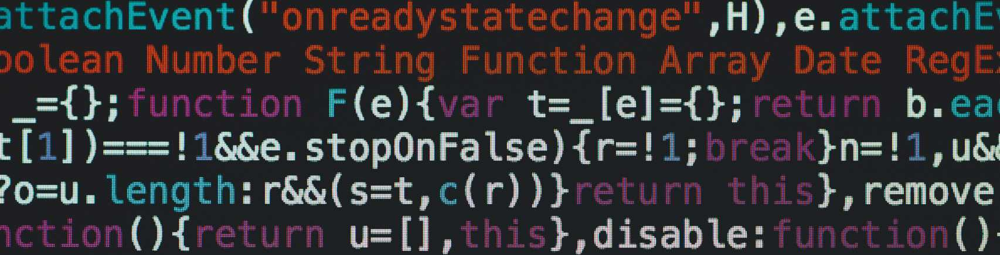

 

### Hi there 👋, 
### I am a life long learner on technology. I have passions on coding, electronics and other cool stuffs.  

 

<!-- https://shields.io/ -->
# :robot: Tech Stacks

 

# :bar_chart: Github Stats

 

# :writing_hand: Writtings 
I started to write blogs on Medium for learning purporse. Take a look [here](https://medium.com/@nelsonchoon)

 

# Social Media

&nbsp;&nbsp
&nbsp;&nbsp
&nbsp;&nbsp

